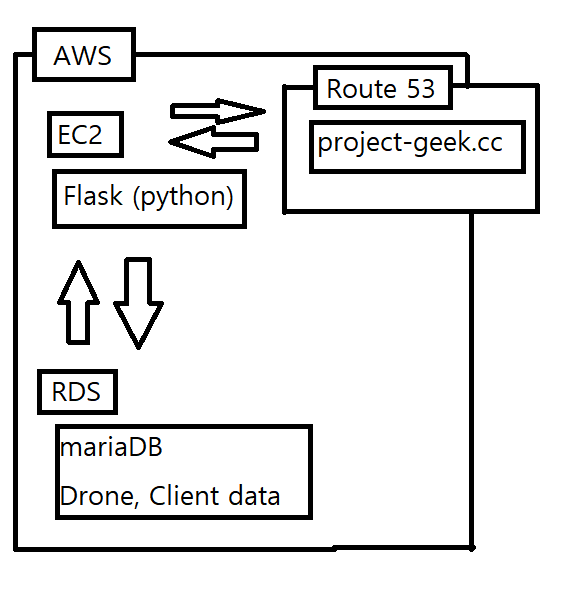

포스터 내용
===
2021-05-30 김규형

# 도식도
전체 서비스 개요를 나타낸 도식도

## 서버
서버쪽 개요를 나타낸 도식도

  
위 도식도 EC2랑 RDS에 하위 항목 다른것처럼 네모로 묶어야 함.
도식도에 ①②③같이 번호를 주고 아래에서 설명해야 함.

## Server - AWS
 - 아마존에서 제공하는 클라우드 컴퓨팅 서비스

### EC2 
 - 켜놓은 시간을 기준으로 과금하는 구조의 클라우드 컴퓨팅 서비스
 - 성능 및 트래픽에 따라 과금이 기하급수적으로 늘어남
 - 기본적으로 제공하는 OS는 CentOS를 EC2에 맞게 커스텀한 OS. 우리 서비스에서도 사용중임을 강조.

### Flask
 - Python 기반 웹 프레임워크
 - REST API에 맞게 프로그래밍 가능
 - 현재 우리 서비스에서는 조회는 GET으로, 데이터 입력은 PUT으로 하고있음
 - Flask에서 조회 / 입력하는 데이터는 RDS의 MariaDB로 넘어가서 처리됨

### RDS
 - AWS에서 제공하는 DB 전용 클라우드 컴퓨팅 서비스
 - 여러가지 DB를 사용할 수 있음. 우리는 ㅡariaDB를 사용중

### MariaDB
 - MySQL가 오라클로 넘어간 후 대안으로 나온 오픈소스 DBMS
 - MySQL과 기능적으로 동일하다.
 - 각 드론의 배터리, 펌웨어 버전, OS 버전, 각 유저의 ID, Password 등 개인 데이터, 드론과 유저의 GPS 등 모든 정보를 여기서 저장함.

## Client
클라이언트 도식도 넣어야함
1~8번 화면 도식도 설명 넣어야 함

## Drone
 - 우리 서비스는 드론이 주가 아니라, 드론 제공 플랫폼이 주이므로 미구현 기능은 가상 데이터를 사용한다는 것을 강조해야함
 - GPIO를 통해 I2C, Serial 통신을 함.
 - I2C에서는 자이로, 가속도, 지자기 데이터를 받아오고, Serial에서는 GPS 데이터를 받아옴
 - GPIO에 Output으로 모터를 제어하여 드론이 운행
 - 데이터 전송 및 조화는 project-geek.cc에 Rest로 통신